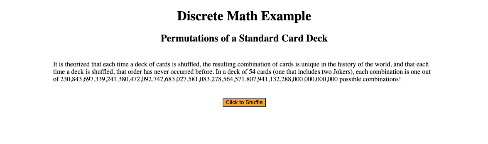
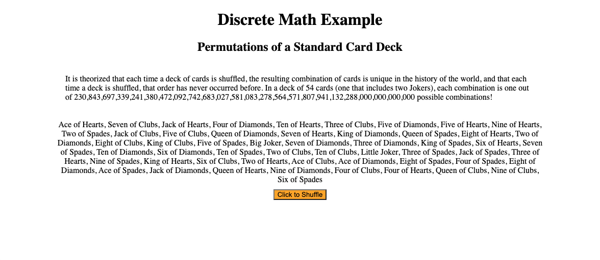

# discreteProject
Simple app to highlight some form of discrete math.  
This app will highlight permutations.

## To use
1. Clone the repository
2. Open your browser of choice
3. From the `<file>` menu at the top, select `<open>`
4. Select `<index.html>`
5. Click button to shuffle/reshuffle the cards.  
	
	With this program, I had intended to create a React App to shuffle a deck of cards. I began early, thinking I had plenty of time, but current events distracted me. Due to current events, I lost focus and fell into a brief but deep depression. In the end, I scrapped the React portions of the program and settled upon a simple JavaScript app. I displayed it through HTML so that anyone who wanted to test the program could do so without needing to install Node or make use of command line prompts. All they have to do is download the program, open their browser of choice, and open the HTML file.  	
	The app itself is pretty straight-forward. It has a title, subtitle, a brief informational blurb, and a single button with the instructions, "Click to shuffle". Behind the scenes, I have the text names of the cards in a standard deck of playing cards stored in an array and a single function to shuffle the deck and return the new order.  
	Once the user clicks the button, it runs an algorithm that selects an element (a single card) from the array (the deck) at random, removes that card from the deck, and saves it to a new array. Once all of the cards have been randomly removed and added to the new array, the new array is displayed on the screen.	    
	To further develop this app, I would like to use images of the cards. I have made a similar program for tarot cards, but I used someone else's algorithm for the shuffle.
	
###This is the app when it opens:

###This is the app after clicking the button:

